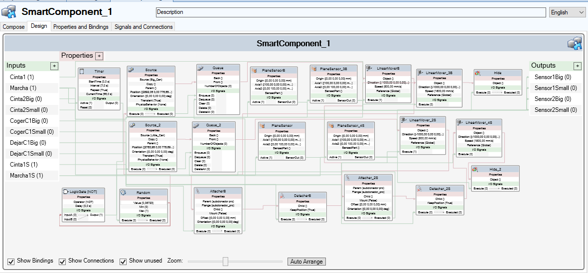
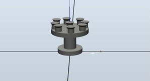

# README
# Proyecto Final de Sistemas Flexibles de Manufactura
Para el Proyecto Final utilizamos el brazo IRB120 con un tool creado por nosotros para poder realizar el pick and place de dos piezas hacia diferentes cintas.
Para poder realizar eso creamos un smart component que incluye a las cintas transportadoras y a el tool.
Este proyecto fue realizado por Kenneth Harewood y  Kenneth Chen.

## Vacuum Tool

## RAPIDCODE
El RAPIDCODE tiene comentarios para cada una de las funciones del código.

## Funcionamiento
El código, de forma general, realiza el proceso de generar una pieza, generada por un random en el smart component, la misma al llegar al final de la cinta, dependiendo de su tamaño, cumplirá unas condiciones para ser llevada a la cinta para las latas grandes o a la cinta de las latas pequeñas, y al estar llegar al final y tener contacto con un sensor, empiezan nuevamente las funciones del sistema para que se pueda realizar de forma continua.

Adjuntamos el vídeo del funcionamiento del sistema a continuación:

## Archivos
En este repositoria está el pack and go de el sistema completo y también el módulo del sistema, donde está el código Rapid.
